<div align="center">


<h1>Data Platform Accelerator</h1>

<p><strong>The Strategic Catalyst for Deploying Governed, Scalable, and Production-Ready Modern Data Platforms at Enterprise Velocity</strong></p>

[]()
[]()
[]()
[]()

<br/>

> **"Transforming data ambition into production reality."** 
> Data Platform Accelerator is a flagship platform designed to enable organizations to rapidly deploy secure, governed, and high-performance data platforms across Azure, AWS, GCP, and hybrid estates.

</div>

---

## 🏛️ Executive Summary

**Data Platform Accelerator** is a flagship repository designed for Chief Data Officers (CDOs), CIOs, and Platform Engineering leads. Building a modern data platform from scratch is a multi-month undertaking fraught with complexity, security risks, and governance gaps.

This accelerator provides a complete **Data Operating System**, delivering production-ready **Infrastructure as Code (Terraform)**, **Onboarding Engines**, **Reusable Ingestion Pipelines**, and **Executive Dashboards**. It supports **Databricks**, **Snowflake**, and **Microsoft Fabric**, enabling teams to go from "Cloud-Zero" to a governed **Lakehouse** or **Warehouse** in hours rather than months.

---

## 💡 Why Data Platforms Matter

In the era of AI and real-time analytics, data platforms are the "Central Nervous System" of the enterprise.
- **Decision Speed**: Moving from batch to real-time insights for competitive advantage.
- **AI Readiness**: Providing clean, governed, and accessible data for LLMs and ML models.
- **Cost Transparency**: Moving from "Black Box" data spend to granular domain-level accountability.
- **Trust & Compliance**: Ensuring every bit of data is classified, governed, and auditable.

---

## 🚀 Business Outcomes

### 🎯 Strategic Platform Impact
- **80% Reduction in TTM**: Rapidly deploy production-ready data environments using pre-built blueprints.
- **Industrialized Governance**: Built-in data quality, cataloging, and security controls by default.
- **Self-Service Enablement**: Empowering domain teams to provision their own workspaces and pipelines.
- **Multi-Cloud Agility**: Seamlessly deploy and manage data assets across Azure, AWS, and GCP.

---

## 🏗️ Technical Stack

| Layer | Technology | Rationale |
|---|---|---|
| **IaC Foundation** | Terraform | Multi-cloud infrastructure orchestration and consistency. |
| **Control Plane** | FastAPI | High-performance API for platform onboarding and metadata. |
| **Frontend** | React 18, Vite | Premium portal for platform exploration and reporting. |
| **Data Stack** | Spark / dbt / Airflow | Industrial-grade data processing and orchestration. |
| **Storage** | ADLS / S3 / GCS | Cloud-native, scalable object storage for lakehouse assets. |
| **Database** | PostgreSQL | Centralized repository for platform state and metadata. |

---

## 📐 Architecture Storytelling: 65+ Diagrams

### 1. Executive High-Level Architecture
The holistic vision of the automated data platform journey.

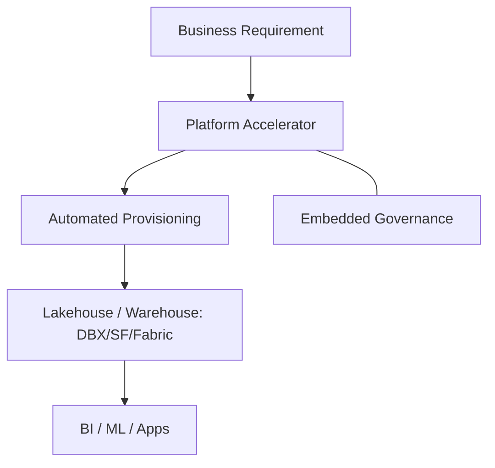

### 2. Detailed Component Topology
The internal service boundaries and management layers of the accelerator.

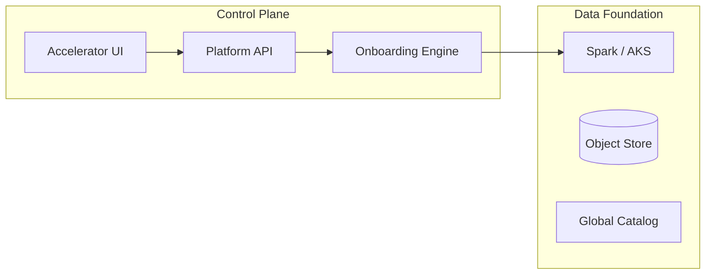

### 3. Frontend to Backend Request Path
Tracing a "Deploy New Data Workspace" request through the platform.

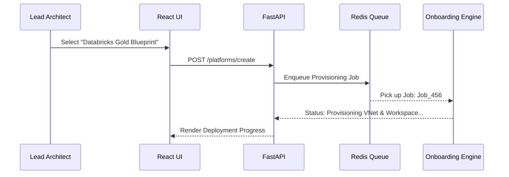

### 4. Platform Control Plane
The brain of the accelerator managing cross-cloud environments.

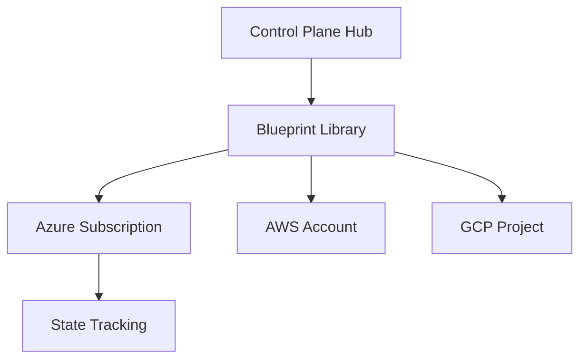

### 5. Multi-Cloud Topology
Synchronizing data platform standards across major cloud providers.

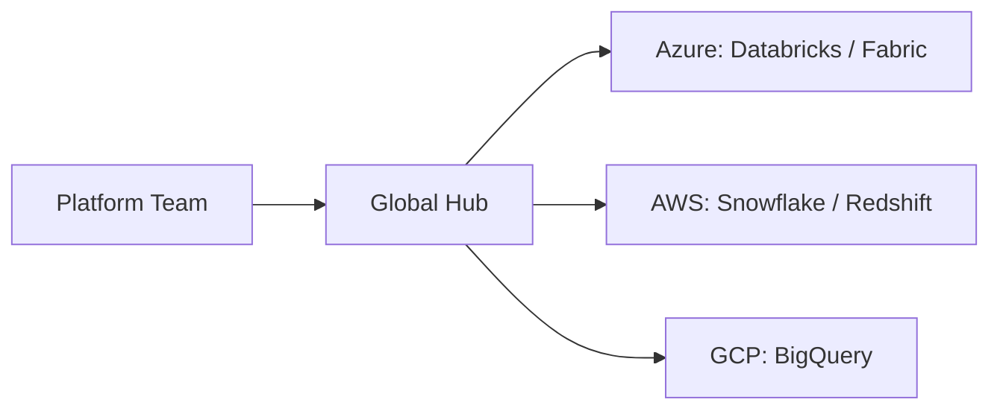

### 6. Regional Deployment Model
Hosting data platforms close to the source for performance and sovereignty.

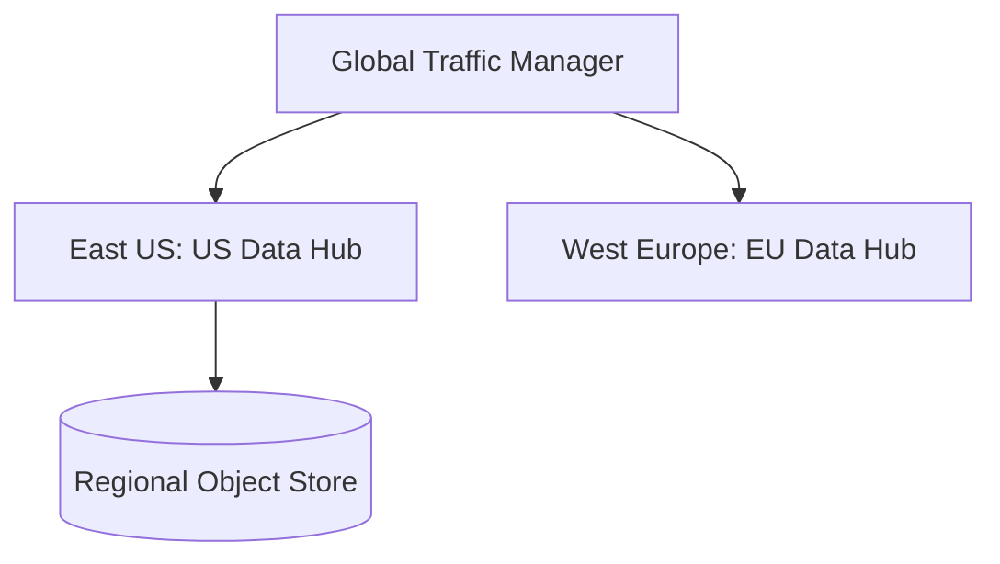

### 7. DR Failover Model
Ensuring platform continuity during regional cloud outages.

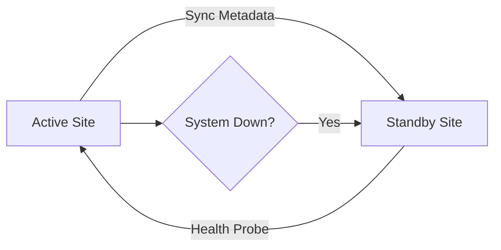

### 8. API Gateway Architecture
Securing and throttling the entry point for platform orchestration.

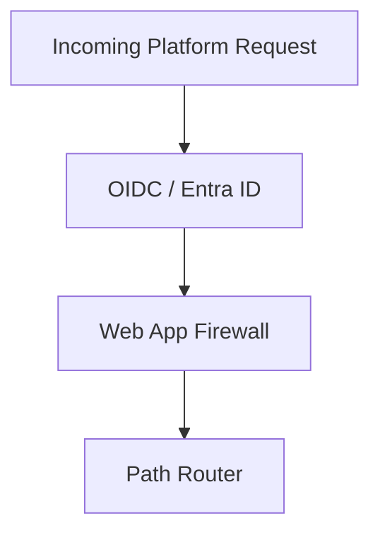

### 9. Queue Worker Architecture
Managing long-running provisioning and scoring tasks.

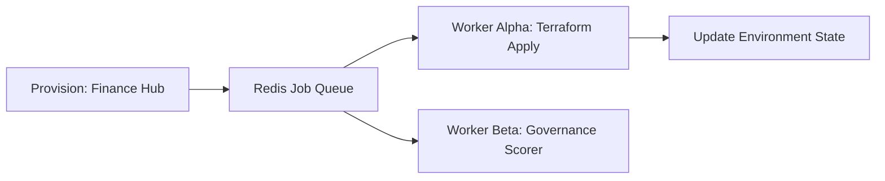

### 10. Dashboard Analytics Flow
How raw platform telemetry becomes executive reliability scorecards.

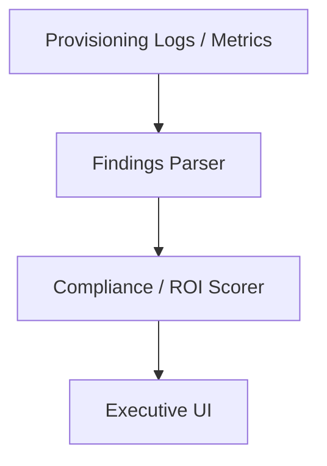

### 11. Landing Zone Architecture
Secure foundations for data workloads.

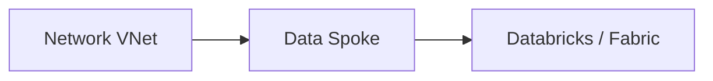

### 12. Network Hub-Spoke Model
Centralized connectivity for the data estate.

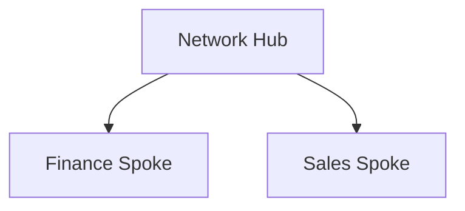

### 13. Shared Services Topology
Reusable components across the mesh.

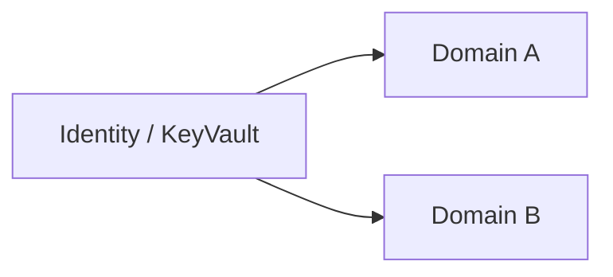

### 14. Identity Federation Flow
Standardizing access across clouds.

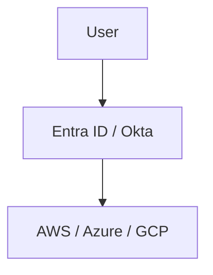

### 15. RBAC Operating Model
Governing access via personas.

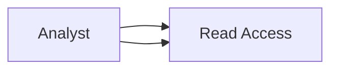

### 16. Secrets Management Lifecycle
Automated credential rotation.

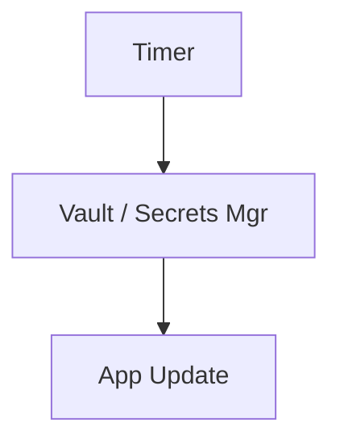

### 17. Key Management Workflow
Protecting encryption keys.

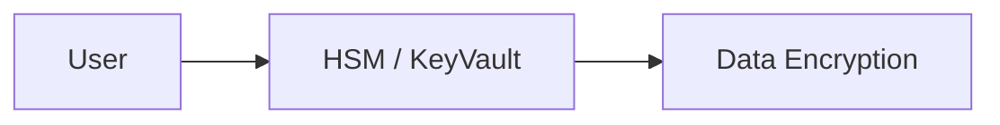

### 18. Budget Governance Flow
Managing cloud data spend.

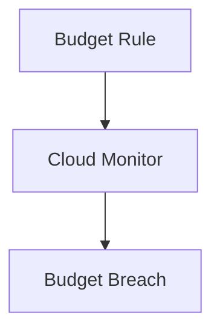

### 19. Chargeback Model
Allocating costs to business units.

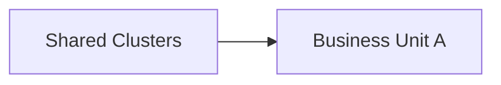

### 20. Environment Promotion Lifecycle
Moving from dev to prod with confidence.

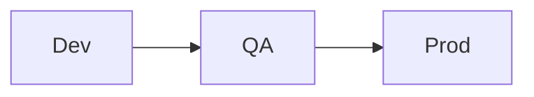

### 21. Batch Ingestion Workflow
Standardized patterns for historical data.

```mermaid
graph TD
    Source[ERP / CRM] --> Copy[ADF / Airflow]
    Copy --> Bronze[Bronze Table]
```

### 22. CDC Pipeline Flow
Low-latency data synchronization.

```mermaid
graph LR
    DB[PostgreSQL] --> Debezium[CDC]
    Debezium --> Silver[Silver Layer]
```

### 23. Streaming Ingestion Model
Real-time events to lakehouse.

```mermaid
graph TD
    Event[Kafka / EventHub] --> Spark[Spark Streaming]
    Spark --> Delta[Delta Lake]
```

### 24. Bronze Layer Architecture
Unstructured landing zone.

```mermaid
graph LR
    Files[JSON / CSV] --> Bronze[Raw Tables]
```

### 25. Silver Transformation Flow
Cleaning and deduplication.

```mermaid
graph TD
    Bronze[Raw] --> Clean[Dedupe / Filter]
    Clean --> Silver[Silver]
```

### 26. Gold Serving Model
Optimized for business consumption.

```mermaid
graph LR
    Silver[Silver] --> Agg[Aggregations]
    Agg --> Gold[Gold Tables]
```

### 27. dbt Transformation Lifecycle
Version-controlled data modeling.

```mermaid
graph TD
    Models[SQL Models] --> Test[dbt test]
    Test --> Deploy[Deploy View]
```

### 28. Data Quality Gates Workflow
Blocking bad data before it hits gold.

```mermaid
graph LR
    Check[DQ Rule] --> Pass{Valid?}
    Pass -->|No| Quarantine[Quarantine]
```

### 29. Schema Evolution Model
Managing changes to data structure.

```mermaid
graph TD
    Change[New Col] --> Merge[Schema Merge]
```

### 30. Data Contract Lifecycle
Agreements between producers and consumers.

```mermaid
graph LR
    Draft[Draft Contract] --> Signoff[Active Contract]
```

### 31. Semantic Layer Architecture
Unified metrics across BI tools.

```mermaid
graph TD
    Gold[Gold] --> Semantic[Cube / View]
    Semantic --> BI[Power BI / Tableau]
```

### 32. Power BI Integration Flow
Azure-native analytics serving.

```mermaid
graph LR
    Fabric[Fabric / Synapse] --> PBI[Power BI]
```

### 33. Tableau Integration Flow
Multi-cloud analytics serving.

```mermaid
graph LR
    Snowflake[Snowflake] --> Tableau[Tableau]
```

### 34. Self-service Analytics Model
Empowering non-technical users.

```mermaid
graph TD
    User[Business User] --> Market[Data Marketplace]
    Market --> Analytics[Self-Service Dashboard]
```

### 35. Feature Engineering Workflow
Preparing data for ML.

```mermaid
graph LR
    Gold[Gold] --> Encode[One-Hot / Scale]
    Encode --> Features[ML Features]
```

### 36. Feature Store Architecture
Reusing features across models.

```mermaid
graph TD
    Features[Features] --> Store[Feature Store]
    Store --> Train[Training Job]
```

### 37. Model Training Data Flow
Building the next generation of intelligence.

```mermaid
graph LR
    Store[Feature Store] --> Training[MLflow / SageMaker]
```

### 38. Real-time Scoring Pipeline
Serving ML predictions instantly.

```mermaid
graph TD
    API[Prediction API] --> Model[Loaded Model]
```

### 39. GenAI Retrieval Workflow
RAG patterns for LLMs.

```mermaid
graph LR
    Lake[Lakehouse] --> Vector[Vector DB]
    Vector --> LLM[Prompt Engine]
```

### 40. Notebook Collaboration Model
Standardized data science environments.

```mermaid
graph TD
    User[Scientist] --> NB[Databricks / Jupyter]
```

### 41. Catalog Integration Flow
Automated metadata discovery.

```mermaid
graph LR
    Source[Tables] --> Purview[Catalog / Governance]
```

### 42. Data Lineage Model
Tracing data from source to dashboard.

```mermaid
graph LR
    In[Source] --> T[Transform]
    T --> Out[Report]
```

### 43. Classification Lifecycle
Identifying sensitive data automatically.

```mermaid
graph TD
    Scan[PII Scan] --> Tag[Confidential]
```

### 44. Retention Governance Flow
Enforcing deletion policies.

```mermaid
graph LR
    Policy[7 Year Rule] --> Delete[Auto-Purge]
```

### 45. Access Request Workflow
Governing the "Just-in-Time" access.

```mermaid
graph TD
    Req[Access Req] --> Appr[Owner Approval]
```

### 46. Pipeline Observability Flow
Monitoring data movement health.

```mermaid
graph LR
    Pipeline[Job] --> Telemetry[Loki / Grafana]
```

### 47. Freshness SLA Model
Guaranteeing data timeliness.

```mermaid
graph TD
    Arrival[Timestamp] --> Check[SLA Breach?]
```

### 48. Incident Response Lifecycle
Standardizing the fix for data failures.

```mermaid
graph LR
    Alert[Failure] --> RCA[Root Cause]
    RCA --> Fix[Resolution]
```

### 49. Reliability Scorecard Workflow
Benchmarking platform health.

```mermaid
graph TD
    Stats[Uptime / DQ] --> Score[A+ Grade]
```

### 50. Cost Anomaly Detection Model
Identifying runaway data spend.

```mermaid
graph LR
    Bill[Cloud Bill] --> Anomaly[Cost Spike]
```

### 51. Metrics Pipeline
Real-time platform telemetry.

```mermaid
graph LR
    App[Engine] --> Prom[Prometheus]
```

### 52. Logging Architecture
Centralized observability records.

```mermaid
graph TD
    Service[Service] --> Loki[Grafana Loki]
```

### 53. Tracing Model
Tracing requests through the stack.

```mermaid
graph LR
    User[User] --> Trace[Jaeger / OTel]
```

### 54. SLA Monitoring Flow
Visualizing performance against targets.

```mermaid
graph TD
    Metric[Latency] --> SLA[SLA Gauge]
```

### 55. Release Pipeline Workflow
Continuous delivery of platform updates.

```mermaid
graph LR
    Git[Code] --> GHA[Deploy]
```

### 56. Executive KPI Review Cycle
Reporting ROI to the leadership.

```mermaid
graph TD
    Stats[Metrics] --> Deck[Executive Report]
```

### 57. Team Operating Model
Aligning engineers and analysts.

```mermaid
graph LR
    Eng[Platform Eng] --> Ana[Analytics Eng]
```

### 58. Intake Workflow
Managing new project requests.

```mermaid
graph TD
    Req[New Project] --> Review[Design Review]
```

### 59. Adoption Maturity Roadmap
The journey to data excellence.

```mermaid
graph LR
    P1[Pilot] --> P2[Scale]
```

### 60. Quarterly Planning cycle
Aligning data strategy with business.

```mermaid
graph TD
    Obj[OKRs] --> Sprint[Sprint Plan]
```

### 61. Databricks Reference Model
Azure/AWS lakehouse implementation.

```mermaid
graph LR
    DBX[Unity Catalog] --> Delta[Delta Lake]
```

### 62. Snowflake Reference Model
Multi-cloud data warehouse.

```mermaid
graph LR
    SF[Snowflake] --> Stage[S3 / Azure Storage]
```

### 63. Fabric Reference Model
SaaS data estate on Azure.

```mermaid
graph LR
    Fabric[OneLake] --> Lakehouse[Item]
```

### 64. BigQuery Reference Model
GCP native analytics.

```mermaid
graph LR
    BQ[BigQuery] --> GCS[Cloud Storage]
```

### 65. Hybrid Lakehouse Model
Connecting on-prem to cloud.

```mermaid
graph TD
    OnPrem[Oracle / SQL] --> VPN[ExpressRoute]
    VPN --> Cloud[Lakehouse]
```

---

## 🔬 Data Platform Accelerator Methodology

### 1. The Accelerator Philosophy
Our approach is built on three core pillars:
- **Standardization**: Implementing "opinionated" patterns for networking, identity, and data structures.
- **Automation**: Removing the human factor from environment provisioning and pipeline deployment.
- **Observability**: Building monitoring into the foundation, ensuring trust is a day-one feature.

### 2. Platform Adoption Roadmap
1. **Foundation (Weeks 1-2)**: Deploying networking, identity, and shared services blueprints.
2. **Onboarding (Weeks 2-4)**: Integrating initial data sources and domain workspaces.
3. **Analytics (Weeks 4-8)**: Developing gold-layer models and BI dashboards.
4. **Optimization (Ongoing)**: Tuning performance, costs, and governance policies.

---

## 🚦 Getting Started

### 1. Prerequisites
- **Terraform** (v1.5+).
- **Docker Desktop**.
- **Azure/AWS/GCP CLI** configured.

### 2. Local Setup
```bash
# Clone the repository
git clone https://github.com/Devopstrio/data-platform-accelerator.git
cd data-platform-accelerator

# Start the Platform Control Plane
docker-compose up --build
```
Access the Accelerator Portal at `http://localhost:3000`.

---

## 🛡️ Governance & Security
- **Security-by-Design**: All blueprints are hardened according to CIS benchmarks and include automated encryption, logging, and identity federation.
- **Embedded Governance**: Data quality and cataloging are not "add-ons"; they are part of the core ingestion and transformation pipelines.
- **Zero-Trust Networking**: All data movement occurs within private networks (Private Link / VNet Peering), ensuring no exposure to the public internet.

---
<sub>&copy; 2026 Devopstrio &mdash; Engineering the Future of Industrialized Data Excellence.</sub>
