<div align="center">


<h1>Data Platform Accelerator</h1>

<p><strong>The Institutional-Grade Platform for Standardized Data Platform Foundations, Modernization Governance, and Multi-Cloud Acceleration Ecosystems.</strong></p>

[]()
[]()
[]()

<br/>

> **"Industrializing data deployment to automate high-performance foundations."** 
> **Data Platform Accelerator** is an enterprise-grade platform designed to provide a secure, measurable, and highly automated foundation for global data platform operations. It orchestrates the complex lifecycle of data platforms—from workspace provisioning and ingestion orchestration to automated transformation baselines and unified platform auditing.

</div>

---

## 🏛️ Executive Summary

Fragmented data platforms and manual environment deployments are strategic operational liabilities; lack of a standardized platform accelerator is a primary barrier to organizational data maturity. Organizations fail to achieve rapid data value not because of a lack of tools, but because of fragmented deployment standards, lack of automated infrastructure validation, and an inability to orchestrate platform planes with operational precision.

This platform provides the **Acceleration Intelligence Plane**. It implements a complete **Data-Platform-Accelerator-as-Code Framework**, enabling Data Engineers and Platform teams to manage global platform foundations as first-class citizens. By automating the identification of deployment bottlenecks through real-time telemetry analysis and orchestrating the provisioning of secure performance-driven platform policies, we ensure that every organizational data team—from central lakehouse squads to domain-specific analytics teams—is supported by default, audited for history, and strictly aligned with institutional acceleration frameworks.

---

## 📐 Architecture Storytelling: Principal Reference Models

### 1. Principal Architecture: Global Data Platform Accelerator & Acceleration Intelligence Plane
This diagram illustrates the end-to-end flow from blueprint ingestion and multi-cloud orchestration to workspace enforcement, performance validation, and institutional platform auditing.

```mermaid
graph LR
    %% Subgraph Definitions
    subgraph BlueprintIngress["Blueprint & Template Ingress"]
        direction TB
        Lakehouse_Blueprints["Databricks / Snowflake / Fabric skeletons"]
        Ingestion_Patterns["CDC / Batch / Streaming Patterns"]
        Security_Baselines["RBAC / Networking / Encryption Libs"]
    end

    subgraph IntelligenceEngine["Acceleration Intelligence Hub"]
        direction TB
        API["FastAPI Accelerator Gateway"]
        Orchestrator["Global Workspace & Ingestion Hub"]
        Governance_Hub["Compliance & Guardrail Hub"]
        AIOps_Validator["Drift & Performance Analysis Hub"]
    end

    subgraph OperationsPlane["Distributed Modernization Ecosystem"]
        direction TB
        ManagedWorkspaces["Managed Standardized Workspaces"]
        ActivePipelines["Managed Automated Ingestion Pipes"]
        ProvisionedLakes["Managed Trusted Data Lakehouses"]
    end

    subgraph OperationsHub["Institutional Data Hub"]
        direction TB
        Scorecard["Acceleration Maturity Scorecard"]
        Analytics["Platform Flow & Readiness Velocity Stats"]
        Audit["Forensic Acceleration Metadata Lake"]
    end

    subgraph DevOps["Data-Platform-Accelerator-as-Code Framework"]
        direction TB
        TF["Terraform Accelerator Modules"]
        DriftBot["Productivity & Config Drift Validator"]
        ChatOps["Measurement Operations Hub"]
    end

    %% Flow Arrows
    BlueprintIngress -->|1. Submit Blueprint| API
    API -->|2. Orchestrate Deployment| Orchestrator
    Orchestrator -->|3. Apply Privacy Guard| Governance_Hub
    Governance_Hub -->|4. Assess Drift| AIOps_Validator
    
    AIOps_Validator -->|5. Execute Provision| OperationsPlane
    OperationsPlane -->|6. Notify Status| ChatOps
    API -->|7. Visualize Health| Scorecard
    
    Scorecard -->|8. Track Maturity| Analytics
    Scorecard -->|9. Record Performance| Audit
    
    TF -->|10. Provision Backbone| IntelligenceEngine
    DriftBot -->|11. Inject Friction Risk| Orchestrator
    Audit -->|12. Improve Operations| ManagedWorkspaces

    %% Styling
    classDef ingress fill:#f5f5f5,stroke:#616161,stroke-width:2px;
    classDef intel fill:#e8eaf6,stroke:#1a237e,stroke-width:2px;
    classDef operations fill:#e1f5fe,stroke:#01579b,stroke-width:2px;
    classDef ops fill:#ede7f6,stroke:#311b92,stroke-width:2px;
    classDef devops fill:#e8f5e9,stroke:#1b5e20,stroke-width:2px;

    class BlueprintIngress ingress;
    class IntelligenceEngine intel;
    class OperationsPlane operations;
    class OperationsHub ops;
    class DevOps devops;
```

### 2. The Acceleration Lifecycle Flow
The continuous path of a data platform accelerator from initial blueprint (definition) and ingestion (pattern) to active provision (workspace), transform (logic), and institutional forensic auditing (scorecard).

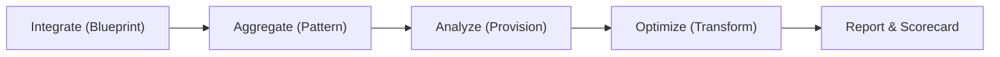

### 3. Distributed Acceleration Topology
Strategically orchestrating standardized platforms across global data teams, diverse lakehouse architectures, and multi-cloud targets, providing a unified institutional view of global platform health and engineering readiness.

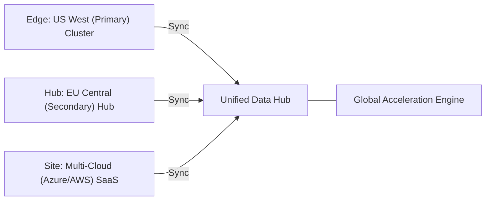

### 4. Safeversion: Platform Governance & High-Trust Data Plane Protection Flow
Executing complex logic for securing the bridge between platform users and production data, ensuring every organizational identity is verified, data-at-rest is encrypted, and every infrastructure access is according to institutional standards.

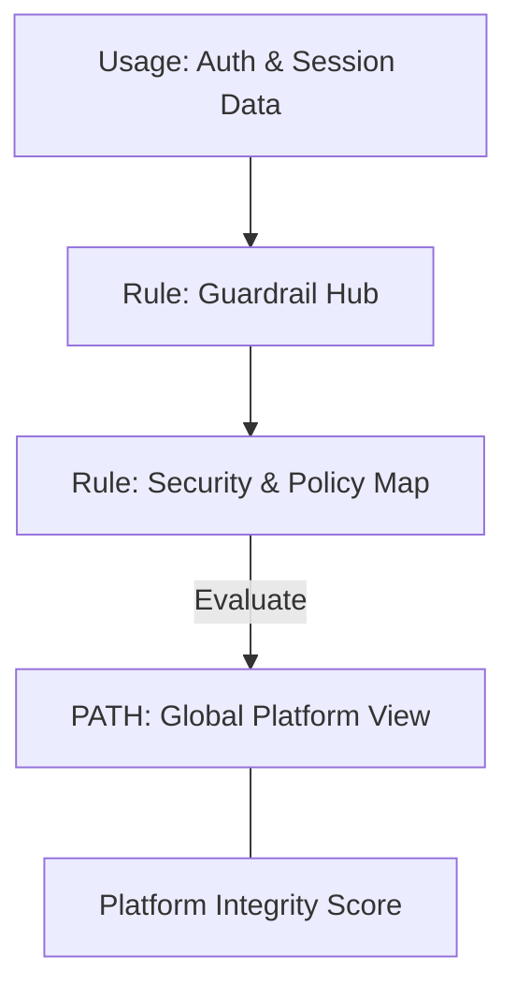

### 5. Safeversion: Multi-Cloud Acceleration Federation & Governance Flow
Automatically managing unified platform standards across global regions and diverse cloud tenants, ensuring institutional data residency and security boundaries by default.

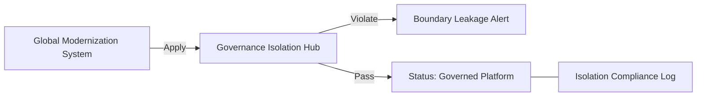

### 6. Safeversion: Encryption & Perimeter Protection Flow (Security Standard)
Managing the lifecycle of a platform request, automatically enforcing institutional TLS 1.3 and resource encryption standards as required by security policy, ensuring zero-latency security confidence.

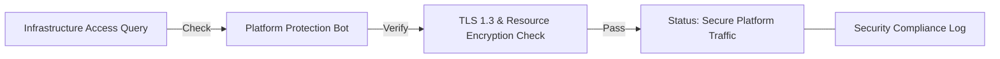

### 7. Institutional Acceleration Maturity Scorecard
Grading organizational performance based on key indicators: Deployment Velocity Grade, Security Library Adoption Index, and CI/CD Readiness Index.

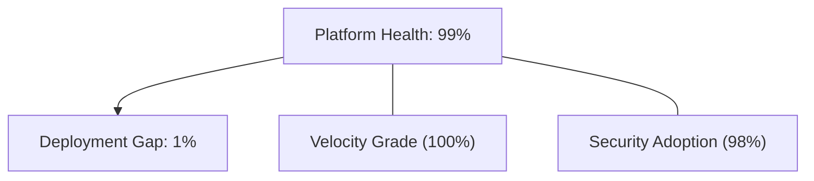

### 8. Identity & RBAC for Platform Governance
Managing fine-grained access to acceleration hubs, provisioning workers, and audit logs between CTOs, Data Engineering Managers, and SREs.

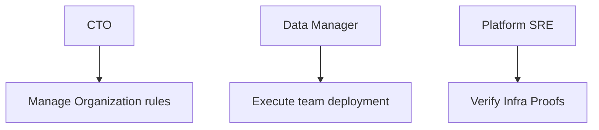

### 9. IaC Deployment: Data-Platform-Accelerator-as-Code Framework
Using modular Terraform to deploy and manage the versioned distribution of the platform tracking hubs, policy protection workers, and forensic metadata lakes.

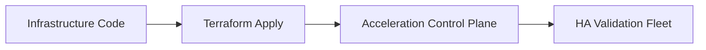

### 10. AIOps Acceleration Drift & Risk Validation Flow
Using advanced analytics to identify sudden surges in deployment times, unauthorized boilerplate changes, suspicious configuration drifts, or unusual delivery pattern changes that could result in institutional risk or developer burnout.

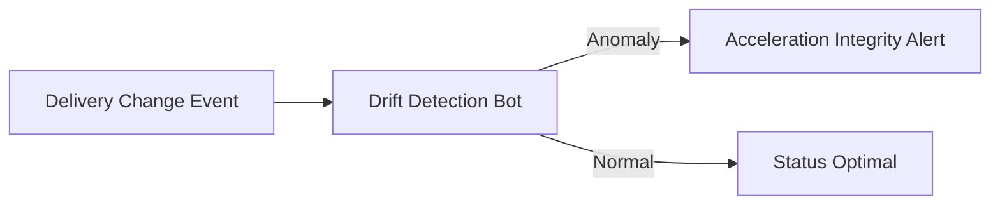

### 11. Metadata Lake for Forensic Acceleration Audit
Storing long-term records of every blueprint integration event (metadata), every workspace provisioned, and every transformation history for institutional record-keeping, compliance auditing, and post-provisioning forensics.

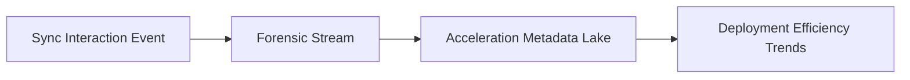

---

## 🏛️ Core Governance Pillars

1.  **Unified Foundation Coordination**: Maximizing productivity by centralizing all engineering measurement through a single institutional plane.
2.  **Automated Platform Provisioning**: Eliminating "manual deployment" scenarios through proactive orchestration and pattern verification.
3.  **Sequential Flow Intelligence**: Ensuring zero-interruption operations through dependency-aware telemetry-driven delivery engineering.
4.  **Zero-Trust Guardrail Protection**: Automatically enforcing identity-based access, team-level aggregation, and policy evaluation across all analytics tiers.
5.  **Autonomous Operations Logic**: Guaranteeing reliability through automated industry-specific effectiveness monitoring runbooks.
6.  **Full Measurement Auditability**: Immutable recording of every metric change and analytics provision for institutional forensics.

---

## 🛠️ Technical Stack & Implementation

### Acceleration Engine & APIs
*   **Framework**: Python 3.11+ / FastAPI.
*   **Performance Engine**: Custom Python-based logic for multi-toolchain ingestion and readiness metrics.
*   **Integrations**: Native connectors for Databricks, Snowflake, Fabric, and Airflow.
*   **Persistence**: PostgreSQL (Acceleration Ledger) and Redis (Live State).
*   **Auth Orchestrator**: Federated OIDC/SAML for least-privilege platform management access.

### Governance Dashboard (UI)
*   **Framework**: React 18 / Vite.
*   **Theme**: Dark, Slate, Indigo (Modern high-fidelity productivity aesthetic).
*   **Visualization**: D3.js for delivery topologies and Recharts for readiness velocity analytics.

### Infrastructure & DevOps
*   **Runtime**: AWS EKS or Azure Kubernetes Service (AKS) for management plane.
*   **Measurement Hub**: Managed event sourcing for immutable productivity timeline reconstruction.
*   **IaC**: Modular Terraform for deploying the platform landing zone and validation fleet.

---

## 🏗️ IaC Mapping (Module Structure)

| Module | Purpose | Real Services |
| :--- | :--- | :--- |
| **`infrastructure/acceleration_hub`** | Central management plane | EKS, PostgreSQL, Redis |
| **`infrastructure/enforcers`** | Distributed platform provisioners | Azure, AWS, GCP APIs |
| **`infrastructure/ingestion_pipes`** | Data Ingestion Hubs | Webhooks, Lambda |
| **`infrastructure/auditing`** | Forensic modernization sinks | S3, Athena, Quicksight |

---

## 🚀 Deployment Guide

### Local Principal Environment
```bash
# Clone the Data Platform Accelerator repository
git clone https://github.com/devopstrio/data-platform-accelerator.git
cd data-platform-accelerator

# Configure environment
cp .env.example .env

# Launch the Acceleration stack
make init

# Trigger a mock blueprint update and automated guardrail validation simulation
make simulate-accelerator
```

Access the Management Portal at `http://localhost:3000`.

---

## 📜 License
Distributed under the MIT License. See `LICENSE` for more information.

---
<div align="center">
  <p>© 2026 Devopstrio. All rights reserved.</p>
</div>
